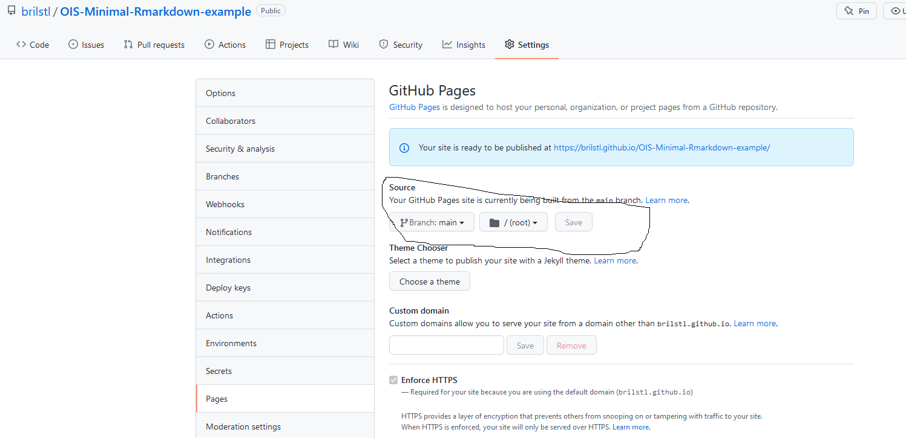

# OIS-Minimal-Rmarkdown-example
 

A minimal example of how to create _and_ host a Rmarkdown file on Github. The document is shown via this link:

- https://brilstl.github.io/OIS-Minimal-Rmarkdown-example/minimal-Rmarkdown-example.html

---

# step 1: create a html document

The first step is to create a document which is able to be published on the internet. In this example a html-file is created through `R`. Before pushing to github, make sure that all the code is working properly.

---

# step 2: public repro

Make sure that the repro is public. You do this by navigating to _settings_.

 

 

In settings go to the bottom of the page and check if the repro is public.

  

---

# step 3: setup pages

Select the _pages_ tab on the sidebar on the top of the page.

 

Set the following options in the settings of the page.

 

 

